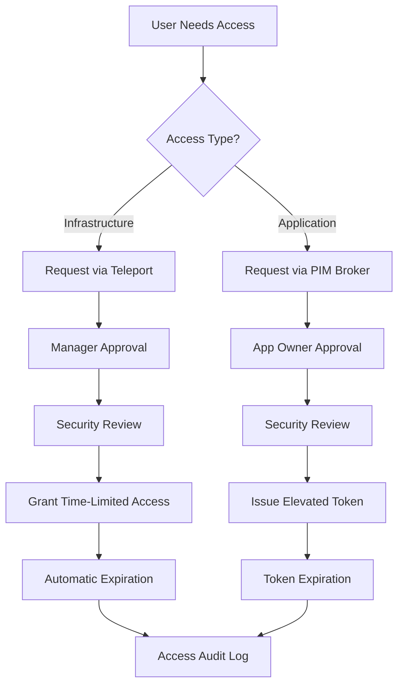

# Business Architecture (TOGAF Phase B)

This document defines the business architecture for the ITL Identity Platform, focusing on business processes, organizational structures, and functional requirements.

## Business Context

### Business Drivers

**Security Requirements**

- **Zero-trust security** mandated by security policy

- **Privileged access management** required for compliance

- **Secrets management** to reduce credential sprawl

- **Audit capabilities** for regulatory compliance

**Operational Efficiency**

- **Self-service access** to reduce manual overhead

- **Automated provisioning** to improve consistency

- **Centralized identity management** across environments

- **Streamlined approval processes** for faster delivery

**Developer Experience**

- **Transparent authentication** for applications

- **Minimal configuration** required from development teams

- **Clear documentation** and examples

- **Consistent patterns** across all services

### Business Objectives

**Primary Objectives**

1. **Reduce Security Risk**: 90% reduction in static secrets within 6 months

2. **Improve Compliance**: 100% of privileged access via audited JIT mechanisms

3. **Enhance Productivity**: <5 minute average access request fulfillment

4. **Ensure Reliability**: 99.9% availability for identity services

**Secondary Objectives**

1. **Cost Optimization**: Reduce manual identity operations by 75%

2. **Knowledge Transfer**: Self-service capabilities reduce dependency on experts

3. **Standardization**: Consistent identity patterns across all platforms

## Business Processes

### Human Access Management

#### Access Request Process

**Process Steps**

1. **Request Initiation**
   - User submits access request with justification
   - System validates user eligibility and request scope
   - Request routed to appropriate approval workflow

2. **Approval Workflow**
   - Manager approval for infrastructure access
   - Application owner approval for application access
   - Security team review for high-privilege requests

3. **Access Provisioning**
   - Automated credential issuance upon approval
   - Time-bounded access with automatic expiration
   - Real-time notification to requester and approvers

4. **Access Monitoring**
   - Continuous monitoring of active sessions
   - Audit logging of all access activities
   - Alerting on anomalous access patterns

5. **Access Revocation**
   - Automatic expiration based on time limits
   - Manual revocation for security incidents
   - Cleanup of temporary permissions and credentials

#### Emergency Access Process

**Trigger Conditions**

- Production incidents requiring immediate access

- Security incidents requiring rapid response

- Business-critical operations outside normal hours

**Process Flow**

1. **Emergency Declaration**: Incident commander declares emergency access need

2. **Accelerated Approval**: Emergency approval by on-call security personnel

3. **Extended Monitoring**: Enhanced logging and monitoring during emergency access

4. **Post-Incident Review**: Mandatory review of emergency access usage

### Workload Identity Management

#### Application Onboarding

**Process Steps**

1. **Requirements Gathering**
   - Application team defines identity requirements
   - Security team reviews access patterns
   - Platform team validates technical feasibility

2. **Identity Configuration**
   - SPIFFE entries created for workload selectors
   - OPA policies defined for access control
   - Integration patterns documented

3. **Testing & Validation**
   - Identity attestation verified in test environment
   - Access patterns validated against policies
   - Performance impact assessed

4. **Production Deployment**
   - Gradual rollout with monitoring
   - Validation of identity issuance and verification
   - Documentation updates and team training

#### Token Exchange Process

**Business Flow**

1. **Application Authentication**: Workload obtains SPIFFE identity

2. **Privilege Request**: Application requests elevated permissions

3. **Token Exchange**: SPIFFE identity exchanged for application token

4. **Authorized Operations**: Application performs privileged operations

5. **Token Expiration**: Access automatically revokes after time limit

## Organizational Model

### Roles and Responsibilities

#### Platform Team

**Identity Platform Owner**

- **Responsibilities**: Overall architecture and platform strategy

- **Authority**: Technology decisions, resource allocation

- **Accountability**: Platform availability and security

**Platform Engineers**

- **Responsibilities**: Implementation, operations, troubleshooting

- **Authority**: Configuration changes, incident response

- **Accountability**: Service level objectives, operational metrics

#### Security Team

**Identity Security Lead**

- **Responsibilities**: Security requirements, compliance oversight

- **Authority**: Security approval, policy definition

- **Accountability**: Risk management, audit compliance

**Security Engineers**

- **Responsibilities**: Security reviews, incident response

- **Authority**: Emergency access decisions, policy exceptions

- **Accountability**: Security monitoring, threat detection

#### Development Teams

**Application Teams**

- **Responsibilities**: Application integration, testing

- **Authority**: Application-specific identity configuration

- **Accountability**: Proper identity usage, security practices

### Governance Structure

#### Architecture Review Board

**Composition**: Platform Lead, Security Lead, Principal Engineers

**Frequency**: Bi-weekly reviews, ad-hoc for urgent decisions

**Authority**: Architecture decisions, technology standards, exceptions

#### Identity Working Group

**Composition**: Representatives from all application teams

**Frequency**: Monthly meetings, quarterly strategy sessions

**Purpose**: Requirements gathering, best practice sharing, training

## Business Requirements

### Functional Requirements

#### Core Identity Services

**FR-001: Workload Authentication**

- **Requirement**: All Kubernetes workloads must authenticate using SPIFFE identity

- **Acceptance Criteria**: 100% of production workloads have valid SPIFFE certificates

- **Business Value**: Eliminates static secrets, enables fine-grained access control

**FR-002: Human Authentication**

- **Requirement**: All human access must use corporate identity provider

- **Acceptance Criteria**: Integration with existing Keycloak for SSO

- **Business Value**: Centralized identity management, consistent user experience

**FR-003: Just-in-Time Access**

- **Requirement**: Privileged access must be time-bounded and approved

- **Acceptance Criteria**: No standing privileged access, all elevation logged

- **Business Value**: Reduces attack surface, improves audit compliance

#### Access Management

**FR-004: Self-Service Access**

- **Requirement**: Users can request access through automated workflows

- **Acceptance Criteria**: Web-based request system with approval routing

- **Business Value**: Reduces manual overhead, improves request tracking

**FR-005: Automated Approval**

- **Requirement**: Low-risk access requests can be auto-approved

- **Acceptance Criteria**: Policy-based approval with override capabilities

- **Business Value**: Faster access provisioning, consistent policy application

**FR-006: Emergency Access**

- **Requirement**: Emergency access available for critical incidents

- **Acceptance Criteria**: Break-glass access with enhanced monitoring

- **Business Value**: Business continuity during incidents

### Non-Functional Requirements

#### Performance Requirements

**NFR-001: Authentication Latency**

- **Requirement**: Authentication operations complete within 100ms

- **Measurement**: 95th percentile response time

- **Business Impact**: Application performance, user experience

**NFR-002: System Availability**

- **Requirement**: Identity services available 99.9% of time

- **Measurement**: Monthly uptime percentage

- **Business Impact**: Business continuity, developer productivity

#### Security Requirements

**NFR-003: Credential Lifecycle**

- **Requirement**: All credentials expire within maximum time limits

- **Measurement**: Certificate/token TTL compliance

- **Business Impact**: Risk reduction, compliance adherence

**NFR-004: Audit Coverage**

- **Requirement**: All access events logged and retained

- **Measurement**: Audit log completeness and retention

- **Business Impact**: Compliance requirements, incident investigation

#### Scalability Requirements

**NFR-005: User Capacity**

- **Requirement**: Support for 10,000+ users across all environments

- **Measurement**: Concurrent user capacity testing

- **Business Impact**: Organization growth, platform adoption

**NFR-006: Workload Capacity**

- **Requirement**: Support for 100,000+ workload identities

- **Measurement**: SPIFFE entry scale testing

- **Business Impact**: Application portfolio growth

## Business Services

### Identity Services Portfolio

#### Core Services

**Authentication Service**

- **Description**: Verifies user and workload identities

- **Consumers**: All applications and infrastructure

- **SLA**: 99.9% availability, <100ms response time

**Authorization Service**

- **Description**: Makes access control decisions

- **Consumers**: All protected resources

- **SLA**: 99.9% availability, <50ms response time

**Credential Service**

- **Description**: Issues and manages certificates and tokens

- **Consumers**: Workloads requiring credentials

- **SLA**: 99.9% availability, <200ms issuance time

#### Value-Added Services

**Access Request Service**

- **Description**: Manages human access request workflows

- **Consumers**: End users, managers, security team

- **SLA**: 99% availability, <5 minute approval processing

**Audit Service**

- **Description**: Provides access logs and compliance reporting

- **Consumers**: Security team, compliance team, auditors

- **SLA**: 99% availability, real-time log ingestion

**Policy Management Service**

- **Description**: Manages and distributes access policies

- **Consumers**: Policy administrators, enforcement points

- **SLA**: 99.9% availability, <30 second policy propagation

### Service Dependencies

#### Upstream Dependencies

**Keycloak Identity Provider**

- **Relationship**: Identity federation and user management

- **SLA Requirements**: 99.9% availability, <200ms response time

- **Risk**: Single point of failure for human authentication

**Kubernetes API Server**

- **Relationship**: Workload orchestration and resource management

- **SLA Requirements**: 99.9% availability per cluster

- **Risk**: Cluster outages affect workload identity

#### Downstream Dependencies

**Application Services**

- **Relationship**: Consumers of identity and authorization services

- **Requirements**: Compatible with SPIFFE and OIDC standards

- **Risk**: Application teams must adopt new patterns

**Monitoring and Logging**

- **Relationship**: Observability and audit trail collection

- **Requirements**: Real-time log ingestion and alerting

- **Risk**: Audit compliance requires reliable log delivery

## Success Metrics

### Business Value Metrics

**Cost Reduction**

- **Metric**: Reduction in manual identity operations

- **Target**: 75% reduction within 12 months

- **Measurement**: Time tracking of manual processes

**Risk Reduction**

- **Metric**: Reduction in credential-related security incidents

- **Target**: 50% reduction within 6 months

- **Measurement**: Security incident categorization and trending

**Compliance Improvement**

- **Metric**: Audit compliance score improvement

- **Target**: 25% improvement in next compliance audit

- **Measurement**: Audit finding categorization and scoring

### Operational Metrics

**Service Adoption**

- **Metric**: Percentage of applications using identity platform

- **Target**: 90% adoption within 12 months

- **Measurement**: Application inventory and integration tracking

**User Satisfaction**

- **Metric**: Developer satisfaction with identity platform

- **Target**: >4.0/5.0 satisfaction score

- **Measurement**: Quarterly user surveys and feedback

**Process Efficiency**

- **Metric**: Average access request fulfillment time

- **Target**: <5 minutes for standard requests

- **Measurement**: Request system metrics and reporting

---

*This business architecture provides the foundation for understanding organizational impact and requirements. Proceed to Information Architecture for data and application design details.*