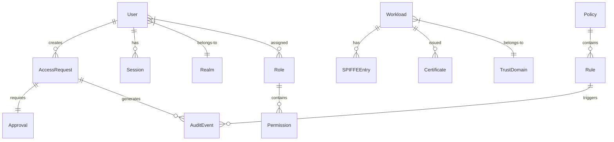
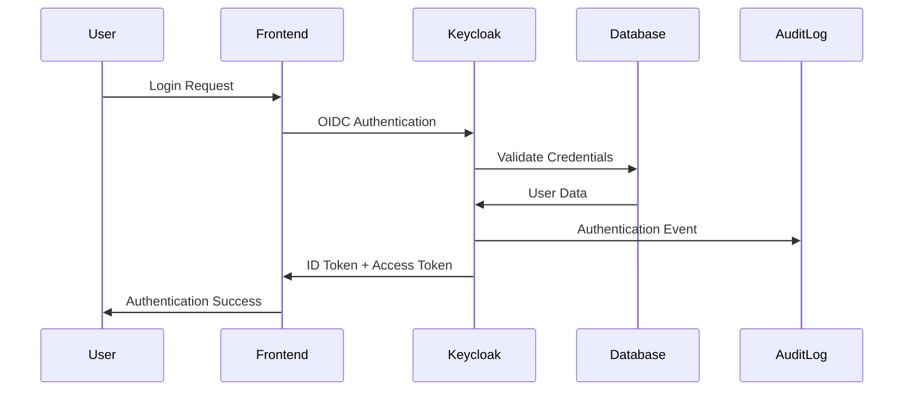
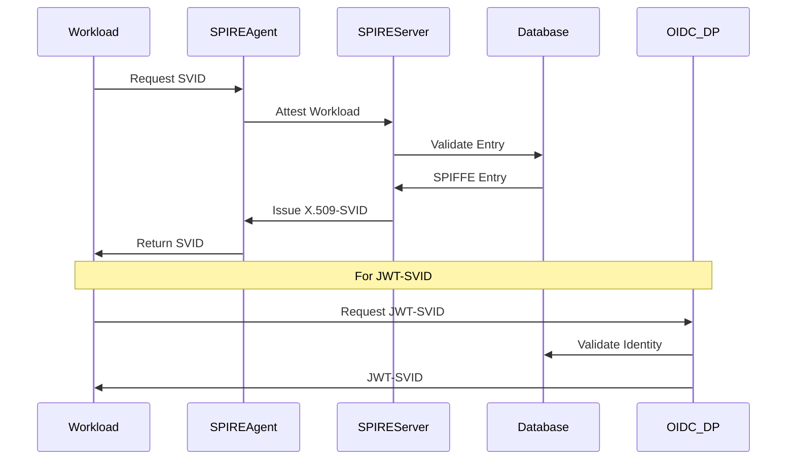
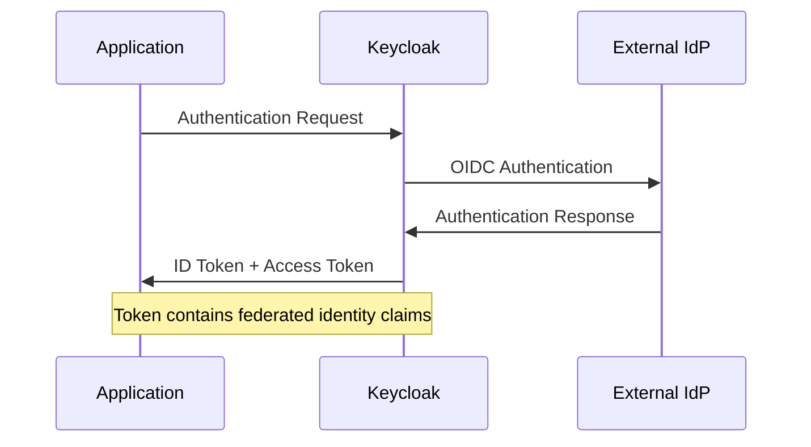
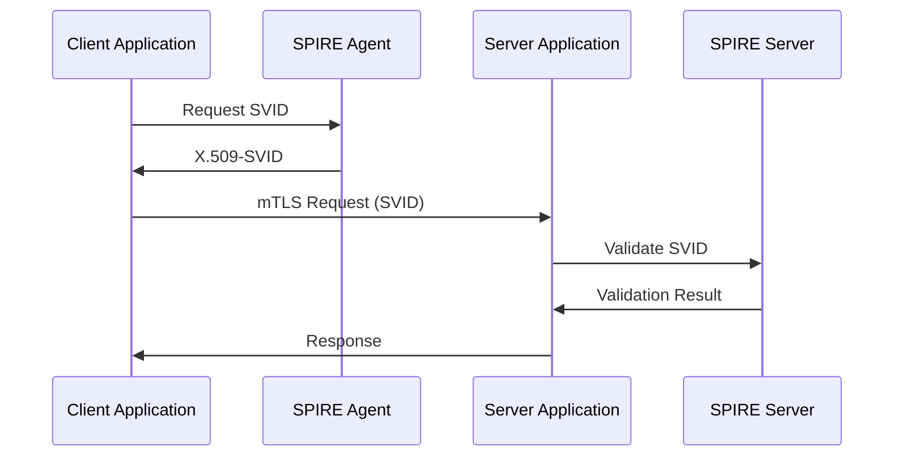
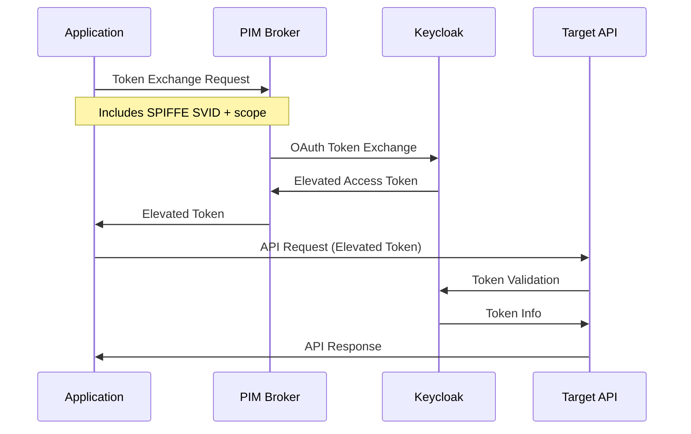
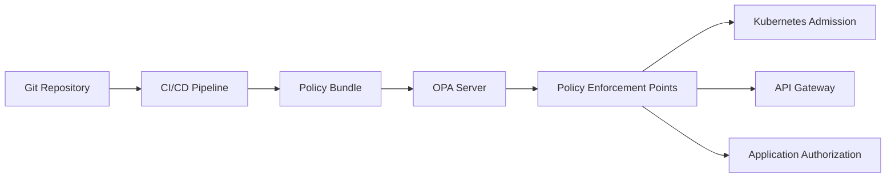
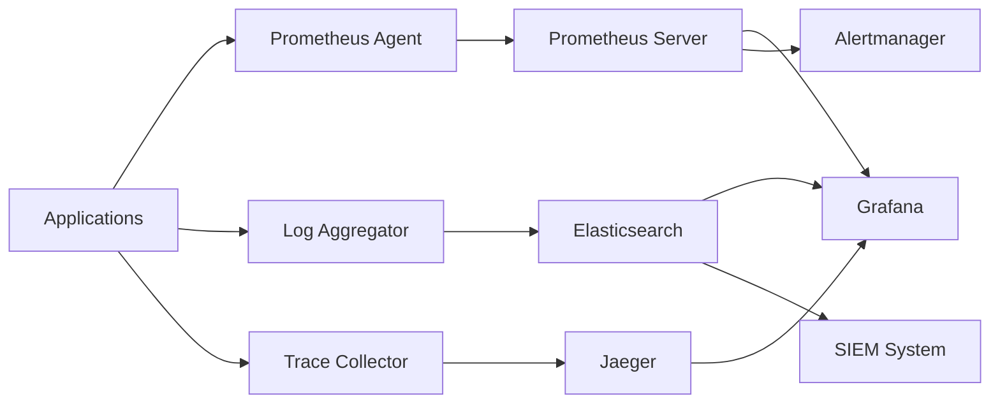
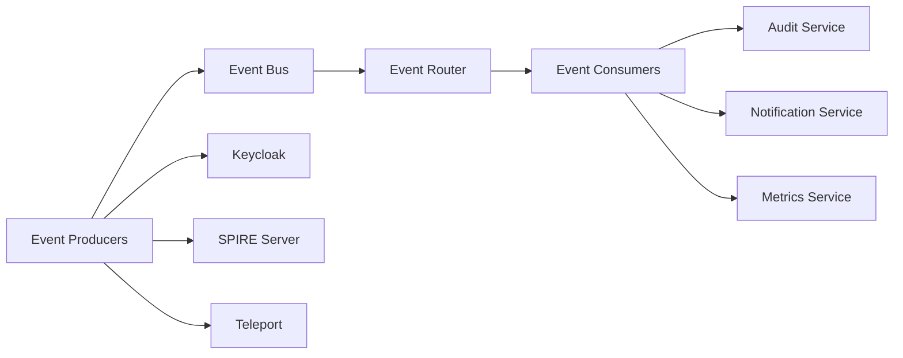

# Information Architecture (TOGAF Phase C)

This document defines the information systems architecture, covering data architecture, application architecture, and integration patterns for the ITL Identity Platform.

## Data Architecture

### Data Entities and Relationships

#### Core Identity Entities



#### Data Entity Definitions

**User Entity**

```yaml
User:
  attributes:
    - id: string (UUID)
    - username: string (unique)
    - email: string
    - realm_id: string (FK)
    - status: enum [active, inactive, suspended]
    - created_at: timestamp
    - last_login: timestamp
  relationships:
    - belongs_to: Realm
    - has_many: AccessRequest
    - has_many: Session
    - has_many: RoleAssignment
```

**Workload Entity**

```yaml
Workload:
  attributes:
    - id: string (UUID)
    - spiffe_id: string (unique)
    - trust_domain: string
    - cluster_name: string
    - namespace: string
    - service_account: string
    - pod_name: string (optional)
    - selector_labels: map[string]string
    - status: enum [active, revoked, expired]
    - created_at: timestamp
    - expires_at: timestamp
  relationships:
    - belongs_to: TrustDomain
    - has_many: Certificate
    - has_many: SPIFFEEntry
```

**AccessRequest Entity**

```yaml
AccessRequest:
  attributes:
    - id: string (UUID)
    - user_id: string (FK)
    - resource_type: enum [kubernetes, database, application]
    - resource_id: string
    - requested_permissions: array[string]
    - justification: text
    - urgency: enum [low, medium, high, emergency]
    - status: enum [pending, approved, denied, expired]
    - requested_at: timestamp
    - expires_at: timestamp
    - approver_id: string (FK, optional)
    - approved_at: timestamp (optional)
  relationships:
    - belongs_to: User
    - has_one: Approval
    - has_many: AuditEvent
```

### Data Storage Architecture

#### Primary Data Stores

**Keycloak Database (PostgreSQL)**

- **Purpose**: User identities, realms, roles, and sessions

- **Data Types**: Structured relational data

- **Characteristics**: ACID compliance, high consistency

- **Retention**: User data retained per privacy policy

- **Backup**: Daily automated backups with point-in-time recovery

**SPIRE Database (SQLite/PostgreSQL)**

- **Purpose**: SPIFFE entries, attestation policies, federation relationships

- **Data Types**: Cryptographic identities and policies

- **Characteristics**: Strong consistency, certificate lifecycle

- **Retention**: Certificate history retained for audit (1 year)

- **Backup**: Continuous backup with CA key protection

**Time-Series Database (Prometheus)**

- **Purpose**: Metrics, performance data, operational telemetry

- **Data Types**: Time-series metrics and labels

- **Characteristics**: High write throughput, compression

- **Retention**: 30 days high resolution, 1 year downsampled

- **Backup**: Periodic snapshots, federation for long-term storage

#### Secondary Data Stores

**Audit Log Store (Elasticsearch)**

- **Purpose**: Audit events, access logs, security events

- **Data Types**: JSON documents with structured fields

- **Characteristics**: Write-heavy, immutable, searchable

- **Retention**: 7 years for compliance requirements

- **Backup**: Daily snapshots with cross-region replication

**Configuration Store (Git Repositories)**

- **Purpose**: Policies, configurations, deployment manifests

- **Data Types**: YAML/JSON configuration files

- **Characteristics**: Version controlled, immutable history

- **Retention**: Permanent with branch/tag management

- **Backup**: Distributed Git repositories with multiple remotes

### Data Flow Architecture

#### Authentication Data Flow



#### Workload Identity Data Flow



### Data Security and Privacy

#### Data Classification

**Highly Sensitive Data**

- **Types**: Private keys, CA certificates, authentication credentials

- **Protection**: Hardware Security Module (HSM) storage

- **Access**: Restricted to platform administrators with MFA

- **Encryption**: AES-256 at rest, TLS 1.3 in transit

**Sensitive Data**

- **Types**: User PII, access logs, audit trails

- **Protection**: Encrypted database storage

- **Access**: Role-based with audit logging

- **Encryption**: AES-256 at rest, TLS 1.3 in transit

**Internal Data**

- **Types**: Configuration, policies, operational metrics

- **Protection**: Standard database security

- **Access**: Team-based with appropriate controls

- **Encryption**: TLS 1.3 in transit, encrypted backups

#### Privacy Controls

**Data Minimization**

- Collect only necessary identity attributes

- Regular review and purging of unused data

- Opt-in consent for optional data collection

**Access Controls**

- Role-based access to personal data

- Audit logging for all data access

- Data masking for non-production environments

**Data Retention**

- Automated deletion per retention policies

- User-requested data deletion capabilities

- Compliance with privacy regulations (GDPR, etc.)

## Application Architecture

### Application Components

#### Core Applications

**Identity Management Applications**

```yaml
Keycloak:
  type: Identity Provider
  responsibilities:
    - User authentication and authorization
    - Realm and client management
    - Token issuance and validation
    - Federation with external identity providers
  interfaces:
    - OIDC/OAuth 2.0 endpoints
    - Admin REST API
    - Database connectivity
  dependencies:
    - PostgreSQL database
    - SMTP server for notifications
```

```yaml
SPIRE_Server:
  type: Workload Identity Authority
  responsibilities:
    - SPIFFE identity issuance
    - Workload attestation
    - Certificate authority operations
    - Trust domain management
  interfaces:
    - SPIRE Agent API (gRPC)
    - Registration API (gRPC)
    - OIDC Discovery Provider integration
  dependencies:
    - Persistent storage for CA keys
    - Database for SPIFFE entries
```

```yaml
SPIRE_Agent:
  type: Workload Identity Client
  responsibilities:
    - Workload attestation
    - Certificate lifecycle management
    - Local SVID caching
    - Workload API serving
  interfaces:
    - Unix domain socket (Workload API)
    - gRPC to SPIRE Server
  dependencies:
    - Container runtime integration
    - Kubernetes API access
```

#### Supporting Applications

**Access Management Applications**

```yaml
Teleport:
  type: Infrastructure Access Gateway
  responsibilities:
    - SSH/Kubernetes access proxying
    - Session recording and audit
    - Access request workflows
    - Certificate-based authentication
  interfaces:
    - SSH protocol gateway
    - Kubernetes API proxy
    - Web UI for access requests
    - REST API for automation
  dependencies:
    - Keycloak for OIDC authentication
    - Backend storage for session recordings
```

```yaml
PIM_Broker:
  type: Application Privilege Manager
  responsibilities:
    - Token exchange orchestration
    - Privilege elevation workflows
    - Approval process management
    - Audit trail generation
  interfaces:
    - REST API for token exchange
    - Webhook integrations (Slack, Jira)
    - Admin UI for policy management
  dependencies:
    - Keycloak for token exchange
    - Database for request tracking
```

**Policy and Governance Applications**

```yaml
OPA_Gatekeeper:
  type: Policy Enforcement
  responsibilities:
    - Admission control for Kubernetes
    - Policy evaluation and enforcement
    - Constraint template management
    - Violation reporting
  interfaces:
    - Kubernetes admission webhook
    - Metrics endpoint (Prometheus)
    - Configuration via CRDs
  dependencies:
    - Kubernetes API server
    - OPA policy bundles
```

```yaml
OIDC_Discovery_Provider:
  type: JWT-SVID Issuer
  responsibilities:
    - JWT-SVID issuance
    - OIDC discovery document serving
    - Key rotation and distribution
    - Token validation endpoint
  interfaces:
    - OIDC discovery endpoints
    - JWT issuance API
    - JWKS endpoint
  dependencies:
    - SPIRE Server for identity validation
    - Certificate storage for signing keys
```

### Application Integration Patterns

#### Authentication Integration

**OIDC Federation Pattern**



**Service-to-Service Authentication**



#### Authorization Integration

**Token Exchange Pattern**



#### Policy Integration

**Policy Distribution Pattern**



### Application Deployment Architecture

#### Deployment Topology

**Management Cluster**

```yaml
management_cluster:
  components:
    - keycloak
    - spire_server
    - teleport_cluster
    - pim_broker
    - oidc_discovery_provider
    - opa_server
  characteristics:
    - High availability deployment
    - Enhanced security controls
    - Comprehensive monitoring
    - Backup and disaster recovery
```

**Workload Clusters**

```yaml
workload_cluster:
  components:
    - spire_agent (daemonset)
    - opa_gatekeeper
    - prometheus_agent
    - log_aggregator
  characteristics:
    - Minimal trust relationships
    - Federation to management cluster
    - Local policy caching
    - Autonomous operation capability
```

#### Container Architecture

**Multi-Stage Container Builds**

```dockerfile
# Example: SPIRE Agent Container
FROM spiffe/spire-agent:latest as spire
FROM ubuntu:22.04

# Install dependencies
RUN apt-get update && apt-get install -y ca-certificates

# Copy SPIRE agent binary
COPY --from=spire /opt/spire/bin/spire-agent /usr/local/bin/

# Configure runtime user
RUN useradd -r -s /bin/false spire-agent

# Security configurations
USER spire-agent
EXPOSE 8081/tcp

ENTRYPOINT ["/usr/local/bin/spire-agent"]
CMD ["run", "-config", "/etc/spire/agent.conf"]
```

**Security Hardening**

- **Non-root containers**: All applications run as non-root users

- **Minimal base images**: Use distroless or minimal base images

- **Security scanning**: Automated vulnerability scanning in CI/CD

- **Resource limits**: CPU and memory limits for all containers

- **Network policies**: Restrict network communication between components

## Integration Architecture

### External System Integration

#### Identity Provider Integration

**Enterprise IdP Federation**

```yaml
external_idp_integration:
  type: OIDC Federation
  providers:
    - azure_ad
    - google_workspace
    - github_enterprise
  configuration:
    - client_id: environment_specific
    - client_secret: from_secret_manager
    - discovery_url: provider_specific
    - scopes: [openid, profile, email, groups]
  claim_mapping:
    - username: preferred_username
    - email: email
    - groups: groups
    - roles: realm_roles
```

#### Monitoring Integration

**Observability Data Flow**



#### Notification Integration

**Workflow Integration**

```yaml
notification_integrations:
  slack:
    purpose: Real-time notifications
    events:
      - access_request_submitted
      - access_approved
      - security_alerts
    configuration:
      webhook_url: from_secret_manager
      channel_mapping: by_team_and_severity
  
  jira:
    purpose: Workflow management
    events:
      - access_request_approval_required
      - security_incidents
      - compliance_violations
    configuration:
      api_endpoint: organization_specific
      project_mapping: by_request_type
```

### API Architecture

#### API Design Principles

**RESTful Design**

- **Resource-oriented**: URLs represent resources, not actions

- **HTTP semantics**: Proper use of HTTP methods and status codes

- **Stateless**: No server-side session state

- **Cacheable**: Appropriate cache headers and ETags

**API Versioning Strategy**

- **URL versioning**: `/api/v1/` prefix for major versions

- **Backward compatibility**: Maintain compatibility within major versions

- **Deprecation policy**: 12-month notice for breaking changes

- **Documentation**: OpenAPI specifications for all endpoints

#### Core API Interfaces

**Authentication API**

```yaml
authentication_api:
  base_url: /api/v1/auth
  endpoints:
    - POST /login: User authentication
    - POST /logout: Session termination
    - GET /userinfo: User profile information
    - POST /token/refresh: Token renewal
  authentication: Bearer token (JWT)
  rate_limiting: 100 requests/minute per user
```

**Identity Management API**

```yaml
identity_api:
  base_url: /api/v1/identity
  endpoints:
    - GET /users: List users
    - GET /users/{id}: Get user details
    - POST /users: Create user
    - PUT /users/{id}: Update user
    - DELETE /users/{id}: Delete user
  authentication: OAuth 2.0 with admin scope
  authorization: RBAC with audit logging
```

**Access Request API**

```yaml
access_request_api:
  base_url: /api/v1/access
  endpoints:
    - GET /requests: List access requests
    - POST /requests: Submit access request
    - GET /requests/{id}: Get request details
    - POST /requests/{id}/approve: Approve request
    - POST /requests/{id}/deny: Deny request
  authentication: Bearer token
  authorization: Role-based with workflow rules
```

### Data Integration Patterns

#### Event-Driven Architecture

**Event Types**

```yaml
identity_events:
  user_created:
    schema: UserEvent
    triggers: User provisioning workflows
    consumers: [notification_service, audit_service]
  
  access_granted:
    schema: AccessEvent
    triggers: Permission changes
    consumers: [policy_service, monitoring_service]
  
  certificate_issued:
    schema: CertificateEvent
    triggers: Workload identity lifecycle
    consumers: [audit_service, metrics_service]
```

**Event Bus Architecture**



#### Batch Data Processing

**Audit Data Pipeline**

```yaml
audit_pipeline:
  source: Application logs, database events
  processing:
    - data_validation
    - enrichment_with_context
    - anonymization_for_privacy
    - correlation_analysis
  destination: Long-term audit storage
  schedule: Real-time streaming with daily batch reconciliation
```

**Compliance Reporting**

```yaml
compliance_reporting:
  frequency: Monthly automated reports
  data_sources:
    - access_logs
    - user_activities
    - policy_violations
  outputs:
    - executive_summary
    - detailed_findings
    - remediation_recommendations
  distribution: Security team, compliance team, executives
```

---

*This information architecture provides the foundation for data and application design. Proceed to Technology Architecture for detailed technology specifications and implementation patterns.*