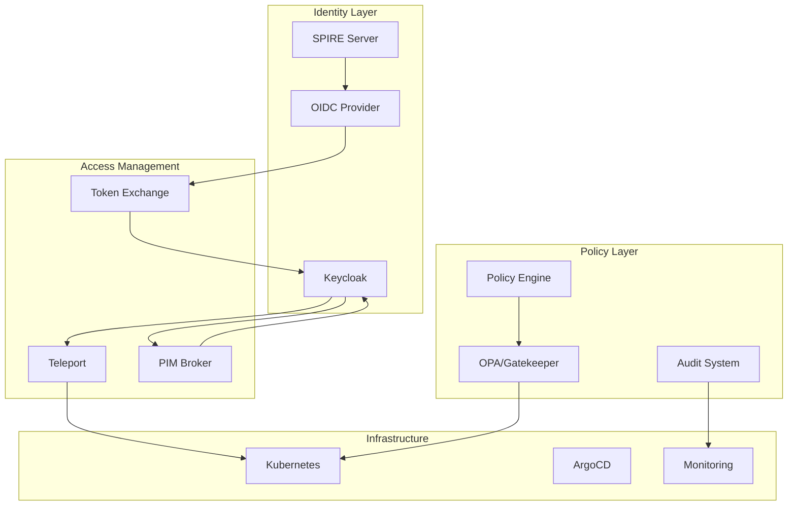

# Architecture Overview

This section provides the complete TOGAF-based architecture documentation for the ITL Identity Platform, following the Architecture Development Method (ADM) phases.

## Architecture Vision

The ITL Identity Platform delivers **Azure-style managed identities and Privileged Identity Management (PIM)** on Kubernetes using our existing **Keycloak** infrastructure for IAM, **SPIFFE/SPIRE** for workload identity, and **Teleport** for JIT elevation, plus an optional **PIM Broker** for application token exchange via Keycloak Token Exchange.

**Mission**: Enable consistent, auditable, short-lived identity for people and workloads across multi-cluster Kubernetes, with PIM/approval workflows and centralized policy governance.

### Key Outcomes

**No long-lived credentials in applications**
- Replace static secrets with SPIFFE identities and short-lived tokens/certificates
- Implement secretless workload patterns across all applications

**Time-bound privileged access**
- Human/Service access elevated only after approval, with short TTL and full audit
- 100% of admin actions via JIT (with justification) by Q2

**Unified identity fabric**
- Consistent identity management across clusters and tenants
- Multi-tenant Keycloak realms with clear RBAC boundaries

### Key Performance Indicators

- **90% reduction in static secrets** within 3 months
- **100% of admin actions via JIT** (with justification) by Q2  
- **Mean approval time < 5 minutes**
- **< 60 minutes MTTR** to revoke elevated access

### Strategic Context

**Business Drivers**

- **Zero-trust security** requirements for cloud-native applications

- **Compliance mandates** for privileged access management

- **Developer productivity** through secretless workload patterns

- **Operational efficiency** via automation and self-service

**Scope & Boundaries**

- **In Scope**: Kubernetes workload identity, infrastructure access, application PIM

- **Out of Scope**: Legacy application integration, non-Kubernetes environments

- **Constraints**: Must integrate with existing Keycloak, OSS-preferred solutions

### Architecture Principles

**Security First**

- **Principle**: Never trust, always verify

- **Rationale**: Zero-trust approach minimizes blast radius

- **Implications**: All access requires authentication and authorization

**Least Privilege**

- **Principle**: Minimum necessary permissions with time-bound access

- **Rationale**: Reduces risk of privilege escalation and lateral movement

- **Implications**: Just-in-time access patterns, short-lived credentials

**Automation First**

- **Principle**: Automate identity lifecycle and access decisions

- **Rationale**: Reduces human error and improves consistency

- **Implications**: Policy-as-code, GitOps deployment patterns

**Observable Operations**

- **Principle**: Comprehensive audit trails for all access

- **Rationale**: Compliance requirements and security monitoring

- **Implications**: Centralized logging, real-time alerting

## Success Criteria

### Key Performance Indicators

**Security Metrics**

- 90% reduction in static secrets within 6 months

- 100% of privileged operations via JIT access

- <60 minutes mean time to revoke access

**Operational Metrics**

- 99.9% identity service availability

- <5 minutes average access request approval

- <2 hours/week manual identity operations

**Business Metrics**

- >4.0/5.0 developer satisfaction score

- 50% reduction in security incidents related to credentials

- 25% improvement in compliance audit scores

## Architecture Phases

This documentation is organized following TOGAF ADM phases:

| Phase | Document | Status | Description |
|-------|----------|--------|-------------|
| **A** | [Architecture Vision](overview.md) | ✅ Complete | Strategic context and principles |
| **B** | [Business Architecture](business-architecture.md) | ✅ Complete | Business processes and requirements |
| **C** | [Information Architecture](information-architecture.md) | 🔄 In Progress | Data and application architecture |
| **D** | [Technology Architecture](technology-architecture.md) | 🔄 Current | Technology components and patterns |
| **E-H** | [Implementation Planning](implementation-planning.md) | ⏳ Planned | Migration and governance strategy |

## Stakeholder Map

### Primary Stakeholders

**Platform Team**

- **Role**: Architecture owners and implementers

- **Interests**: Operational efficiency, maintainability

- **Influence**: High decision-making authority

**Security Team**

- **Role**: Security requirements and compliance

- **Interests**: Risk mitigation, audit compliance

- **Influence**: Security approval authority

**Development Teams**

- **Role**: End users of identity services

- **Interests**: Developer experience, minimal friction

- **Influence**: Adoption and feedback

### Secondary Stakeholders

**Operations Team**

- **Role**: Platform operations and monitoring

- **Interests**: Service reliability, troubleshooting

**Compliance Team**

- **Role**: Regulatory compliance validation

- **Interests**: Audit trails, control effectiveness

**Business Stakeholders**

- **Role**: Budget approval and strategic alignment

- **Interests**: Cost efficiency, business value

## Document Structure

### Navigation Guide

**Start Here**: Review this overview for strategic context

**Business Context**: Read Business Architecture for process understanding

**Technical Details**: Review Information and Technology Architecture

**Implementation**: Consult Implementation Planning for delivery approach

**Reference**: Use appendices for detailed specifications

### Document Conventions

**Status Indicators**

- ✅ Complete: Fully documented and approved

- 🔄 In Progress: Under active development

- ⏳ Planned: Scheduled for future development

- ❌ Blocked: Waiting for dependencies

**Decision Recording**

- Architecture decisions documented as ADRs

- Cross-references to related decisions

- Status tracking through governance process

---

*This overview provides the entry point to the complete TOGAF-based architecture documentation. Navigate to specific phases using the links above.*

- **Token Exchange** - Keycloak-based elevation workflows

### Policy & Governance Layer

- **OPA** - Fine-grained authorization policies

- **Audit** - Comprehensive logging and compliance

- **Approval Workflows** - Slack/Jira integration for human oversight

### Infrastructure Layer

- **Kubernetes** - Container orchestration platform

- **GitOps** - ArgoCD for declarative configuration

- **Observability** - Prometheus, Grafana, and SIEM integration

## Component Interactions

## Security Boundaries

### Trust Domains
- **SPIFFE Trust Domain**: `spiffe://synora.local`
- **Environment Separation**: dev/test/prod via domain hierarchy
- **Tenant Isolation**: Keycloak realm boundaries

### Network Segmentation
- **mTLS**: Service-to-service communication via SPIFFE
- **Ingress Control**: Traefik/NGINX with TLS termination
- **Egress Policies**: Restricted outbound communication

### Data Protection
- **Encryption at Rest**: Kubernetes secrets, database encryption
- **Encryption in Transit**: TLS 1.3 for all external communication
- **Key Management**: External Secrets Operator with Azure KeyVault

## Operational Model

### Deployment Pattern
- **GitOps**: All configuration via Git repositories
- **Helm Charts**: Standardized application packaging
- **Progressive Rollout**: Canary deployments with monitoring

### Monitoring & Alerting
- **Metrics**: Prometheus for component health and performance
- **Logs**: Structured logging with correlation IDs
- **Traces**: Distributed tracing for request flows
- **SLIs/SLOs**: Service level objectives for availability and latency

### Disaster Recovery
- **Backup Strategy**: Automated backups of identity state
- **Cross-region**: Multi-cluster federation capabilities
- **Recovery Testing**: Regular DR exercises and runbooks

## Compliance & Governance

### Audit Requirements
- **Access Logs**: All authentication and authorization events
- **Approval Trails**: Complete workflow audit for elevated access
- **Retention**: 18+ months for compliance requirements

### Separation of Duties
- **Role Segregation**: Requesters ≠ Approvers ≠ Reviewers
- **Multi-person Control**: Critical operations require multiple approvals
- **Regular Reviews**: Quarterly access reviews and attestations

## Next Steps

1. **Review Components** - Understand each [component](../implementation/components.md) in detail
2. **Plan Implementation** - Follow the [getting started guide](../implementation/getting-started.md)
3. **Security Configuration** - Review the [security model](../security/security-model.md)
4. **Deployment** - Use the [deployment guide](../operations/deployment.md)