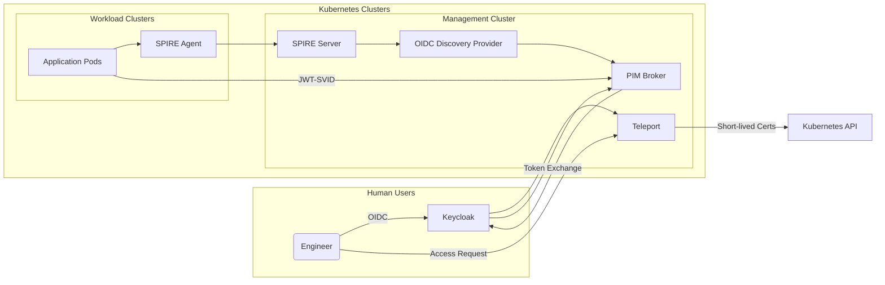

# ITL Identity Platform

Welcome to the ITL Identity Platform documentation. This platform provides Azure-style managed identities and Privileged Identity Management (PIM) on Kubernetes using Keycloak, Teleport, and SPIFFE/SPIRE.

## Overview

The ITL Identity Platform is designed to deliver:

- **Zero-trust architecture** with least privilege access
- **Secretless workloads** using SPIFFE identities
- **Just-in-time (JIT) elevation** for both infrastructure and applications
- **Comprehensive audit trails** for all access requests and approvals
- **Multi-tenant support** with Keycloak realm isolation

## Key Components

### Core Identity Services

- **[Keycloak](https://www.keycloak.org/)** - Identity Provider and Access Management

- **[SPIFFE/SPIRE](https://spiffe.io/)** - Workload Identity Framework

- **[Teleport](https://goteleport.com/)** - Infrastructure Access Management

### Supporting Infrastructure

- **OIDC Discovery Provider** - JWT-SVID issuance

- **PIM Broker** - Application-level JIT token management

- **Policy Engine** - OPA/Gatekeeper for admission control

## Architecture Highlights

## Quick Start

To get started with the ITL Identity Platform:

1. **Review the Architecture** - Start with our [TOGAF Architecture Document](managed-identities-pim-architecture.md)

2. **Plan Your Implementation** - Follow our [Implementation Guide](implementation/getting-started.md)

3. **Deploy Components** - Use our [Deployment Guide](operations/deployment.md)

4. **Configure Security** - Review our [Security Model](security/security-model.md)

## Key Benefits

### Security

- **No static secrets** in workload environments

- **Short-lived credentials** with automatic expiration

- **MFA enforcement** for all privileged operations

- **Comprehensive audit trails** for compliance

### Operations

- **GitOps-driven** configuration management

- **Automated approval workflows** with Slack/Jira integration

- **Policy-as-code** with OPA/Gatekeeper

- **Multi-cluster federation** support

### Developer Experience

- **Transparent identity** for applications

- **Simple token exchange** for elevated permissions

- **Self-service access requests** with approval workflows

- **Clear documentation** and examples

## Getting Help

- 📖 **Documentation**: Browse the sections in the navigation menu

- 🔧 **Implementation**: Check the [Getting Started Guide](implementation/getting-started.md)

- 🔒 **Security**: Review our [Security Model](security/security-model.md)

- 📊 **Operations**: See [Deployment](operations/deployment.md) and [Monitoring](operations/monitoring.md)

## Contributing

This documentation is maintained as part of the ITL platform ecosystem. For contributions or issues, please refer to the project repository.

---

*Last updated: October 2025*