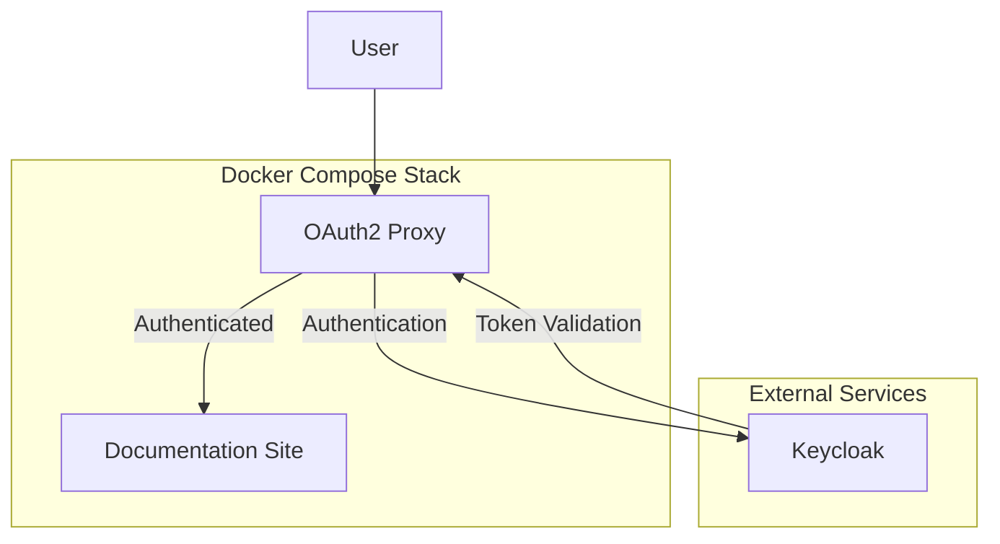

# OIDC Authentication for Documentation Platform

This guide explains how to implement OIDC authentication for the ITL Identity Platform documentation site using Keycloak as the identity provider.

## Overview

The documentation platform can be secured using OpenID Connect (OIDC) to ensure only authorized users can access the architectural documentation and sensitive implementation details.

## Architecture



## Implementation Options

### Option 1: OAuth2 Proxy (Recommended)

OAuth2 Proxy provides a simple way to add OIDC authentication to static sites.

#### Docker Compose Configuration

```yaml
# Updated docker-compose.yml
services:
  oauth2-proxy:
    image: quay.io/oauth2-proxy/oauth2-proxy:v7.5.1
    container_name: itl-docs-oauth2-proxy
    command:
      - --config=/etc/oauth2-proxy.cfg
    ports:
      - "8080:4180"
    volumes:
      - ./oauth2-proxy.cfg:/etc/oauth2-proxy.cfg:ro
    environment:
      OAUTH2_PROXY_CLIENT_ID: ${KEYCLOAK_CLIENT_ID}
      OAUTH2_PROXY_CLIENT_SECRET: ${KEYCLOAK_CLIENT_SECRET}
      OAUTH2_PROXY_COOKIE_SECRET: ${OAUTH2_PROXY_COOKIE_SECRET}
    depends_on:
      - identity-docs
    restart: unless-stopped

  identity-docs:
    build:
      context: .
      dockerfile: Dockerfile
    container_name: itl-docs-backend
    ports:
      - "8081:80"  # Changed to internal port
    volumes:
      - ./nginx.conf:/etc/nginx/nginx.conf:ro
    restart: unless-stopped
```

#### OAuth2 Proxy Configuration

```ini
# oauth2-proxy.cfg
http_address = "0.0.0.0:4180"
upstreams = [ "http://identity-docs:80" ]

# OIDC Provider Settings
provider = "keycloak-oidc"
provider_display_name = "ITL Identity Platform"
oidc_issuer_url = "https://sso.yourdomain.com/realms/itl-platform"
client_id = "${KEYCLOAK_CLIENT_ID}"
client_secret = "${KEYCLOAK_CLIENT_SECRET}"

# Scopes and Claims
scope = "openid email profile groups"
oidc_groups_claim = "groups"
oidc_email_claim = "email"

# Session Configuration
cookie_secret = "${OAUTH2_PROXY_COOKIE_SECRET}"
cookie_domains = [".yourdomain.com"]
cookie_secure = true
cookie_httponly = true
cookie_samesite = "lax"
cookie_expire = "24h"

# Authorization
email_domains = ["yourdomain.com"]
allowed_groups = ["docs-readers", "developers", "architects"]

# Logging
request_logging = true
auth_logging = true

# Headers
pass_basic_auth = false
pass_access_token = false
pass_user_headers = true
set_authorization_header = false
set_xauthrequest = true

# Skip authentication for health checks
skip_auth_regex = [
  "^/health$",
  "^/assets/.*",
  "^/search/.*"
]

# Custom error pages
custom_templates_dir = "/etc/oauth2-proxy/templates"
```

#### Environment Variables

```bash
# .env file
KEYCLOAK_CLIENT_ID=itl-docs-client
KEYCLOAK_CLIENT_SECRET=your-client-secret-here
OAUTH2_PROXY_COOKIE_SECRET=your-32-char-random-string-here
```

### Option 2: Nginx with Lua OIDC Module

For more advanced scenarios, you can use nginx with lua-resty-oidc module.

#### Dockerfile with OIDC Support

```dockerfile
# Multi-stage build with OIDC support
FROM python:3.11-slim as builder

# ... (existing build stage) ...

# Production stage with nginx + lua + oidc
FROM openresty/openresty:1.21.4.1-alpine

# Install dependencies
RUN apk add --no-cache \
    curl \
    ca-certificates \
    && opm get zmartzone/lua-resty-oidc

# Create non-root user
RUN addgroup -g 1000 -S nginx-user && \
    adduser -u 1000 -D -S -G nginx-user nginx-user

# Copy built documentation
COPY --from=builder /app/site /usr/share/nginx/html

# Configure nginx with OIDC
COPY nginx-oidc.conf /etc/openresty/nginx.conf
COPY oidc.lua /etc/openresty/oidc.lua

# Switch to non-root user
USER nginx-user

EXPOSE 80

CMD ["openresty", "-g", "daemon off;"]
```

#### Nginx OIDC Configuration

```nginx
# nginx-oidc.conf
events {
    worker_connections 1024;
}

http {
    lua_package_path "/usr/local/openresty/site/lualib/?.lua;;";
    lua_ssl_trusted_certificate /etc/ssl/certs/ca-certificates.crt;
    lua_ssl_verify_depth 5;
    
    # OIDC configuration
    lua_shared_dict discovery 1m;
    lua_shared_dict jwks 1m;
    lua_shared_dict introspection 10m;
    
    server {
        listen 80;
        server_name localhost;
        
        # OIDC configuration
        set $oidc_redirect_uri "https://docs.yourdomain.com/redirect_uri";
        set $oidc_client_id "itl-docs-client";
        set $oidc_client_secret "your-client-secret";
        set $oidc_discovery_url "https://sso.yourdomain.com/realms/itl-platform/.well-known/openid_configuration";
        
        # Authentication endpoint
        location /redirect_uri {
            access_by_lua_file /etc/openresty/oidc.lua;
        }
        
        # Protected content
        location / {
            access_by_lua_file /etc/openresty/oidc.lua;
            
            root /usr/share/nginx/html;
            index index.html;
            try_files $uri $uri/ $uri.html /index.html;
        }
        
        # Public assets (no auth required)
        location ~* \.(css|js|png|jpg|jpeg|gif|ico|svg|woff|woff2|ttf|eot|map|json)$ {
            root /usr/share/nginx/html;
            expires 1y;
            add_header Cache-Control "public, immutable";
        }
        
        # Health check (no auth required)
        location /health {
            return 200 "healthy\n";
            add_header Content-Type text/plain;
        }
    }
}
```

## Keycloak Client Configuration

### Create OIDC Client

1. **Access Keycloak Admin Console**:
   ```bash
   # Login to Keycloak admin
   https://sso.yourdomain.com/admin
   ```

2. **Create Client**:
   ```json
   {
     "clientId": "itl-docs-client",
     "name": "ITL Documentation Platform",
     "description": "OIDC client for ITL Identity Platform documentation",
     "protocol": "openid-connect",
     "clientAuthenticatorType": "client-secret",
     "enabled": true,
     "publicClient": false,
     "bearerOnly": false,
     "standardFlowEnabled": true,
     "implicitFlowEnabled": false,
     "directAccessGrantsEnabled": false,
     "serviceAccountsEnabled": false,
     "redirectUris": [
       "https://docs.yourdomain.com/oauth2/callback",
       "http://localhost:8080/oauth2/callback"
     ],
     "webOrigins": [
       "https://docs.yourdomain.com",
       "http://localhost:8080"
     ],
     "attributes": {
       "saml.assertion.signature": "false",
       "saml.force.post.binding": "false",
       "saml.multivalued.roles": "false",
       "saml.encrypt": "false",
       "saml.server.signature": "false",
       "saml.server.signature.keyinfo.ext": "false",
       "exclude.session.state.from.auth.response": "false",
       "saml_force_name_id_format": "false",
       "saml.client.signature": "false",
       "tls.client.certificate.bound.access.tokens": "false",
       "saml.authnstatement": "false",
       "display.on.consent.screen": "false",
       "saml.onetimeuse.condition": "false"
     }
   }
   ```

3. **Configure Scopes**:
   ```json
   {
     "defaultClientScopes": [
       "web-origins",
       "roles",
       "profile",
       "email"
     ],
     "optionalClientScopes": [
       "address",
       "phone",
       "offline_access",
       "microprofile-jwt",
       "groups"
     ]
   }
   ```

### Create Groups and Roles

```bash
# Create groups for documentation access
curl -X POST "https://sso.yourdomain.com/admin/realms/itl-platform/groups" \
  -H "Authorization: Bearer $ADMIN_TOKEN" \
  -H "Content-Type: application/json" \
  -d '{
    "name": "docs-readers",
    "attributes": {
      "description": ["Read access to ITL documentation"]
    }
  }'

curl -X POST "https://sso.yourdomain.com/admin/realms/itl-platform/groups" \
  -H "Authorization: Bearer $ADMIN_TOKEN" \
  -H "Content-Type: application/json" \
  -d '{
    "name": "docs-administrators", 
    "attributes": {
      "description": ["Full access to ITL documentation"]
    }
  }'
```

## Security Considerations

### 1. Token Validation

```yaml
# Token validation settings
token_validation:
  verify_signature: true
  verify_issuer: true
  verify_audience: true
  verify_expiration: true
  allowed_skew: 30s
  
# Refresh token handling
refresh_tokens:
  enabled: true
  rotation: true
  lifetime: 30d
  idle_timeout: 24h
```

### 2. Session Security

```yaml
session_security:
  secure_cookies: true
  httponly_cookies: true
  samesite: "strict"
  csrf_protection: true
  session_timeout: 8h
  max_sessions_per_user: 3
```

### 3. Rate Limiting

```nginx
# Rate limiting configuration
http {
    limit_req_zone $binary_remote_addr zone=auth:10m rate=5r/m;
    limit_req_zone $binary_remote_addr zone=docs:10m rate=30r/m;
    
    server {
        location /oauth2/ {
            limit_req zone=auth burst=10 nodelay;
        }
        
        location / {
            limit_req zone=docs burst=50 nodelay;
        }
    }
}
```

## Deployment

### 1. Generate Secrets

```bash
# Generate OAuth2 Proxy cookie secret
openssl rand -base64 32

# Get Keycloak client secret
kubectl get secret keycloak-client-secret -o jsonpath='{.data.client-secret}' | base64 -d
```

### 2. Deploy with Docker Compose

```bash
# Set environment variables
export KEYCLOAK_CLIENT_ID="itl-docs-client"
export KEYCLOAK_CLIENT_SECRET="your-secret-here"
export OAUTH2_PROXY_COOKIE_SECRET="your-cookie-secret-here"

# Deploy the stack
docker compose up -d --build
```

### 3. Verify Deployment

```bash
# Test authentication flow
curl -I http://localhost:8080
# Should redirect to Keycloak login

# Test authenticated access
curl -H "Authorization: Bearer $ACCESS_TOKEN" http://localhost:8080
# Should return documentation content
```

## Monitoring and Logging

### Authentication Metrics

```yaml
# Prometheus metrics for OAuth2 Proxy
metrics:
  - oauth2_proxy_requests_total
  - oauth2_proxy_authentication_attempts_total
  - oauth2_proxy_authentication_duration_seconds
  - oauth2_proxy_sessions_total
```

### Audit Logging

```json
{
  "timestamp": "2025-10-05T02:48:00Z",
  "event": "authentication_success",
  "user": "john.doe@yourdomain.com",
  "groups": ["docs-readers", "developers"],
  "source_ip": "192.168.1.100",
  "user_agent": "Mozilla/5.0...",
  "resource": "/architecture/overview",
  "session_id": "abc123..."
}
```

## Troubleshooting

### Common Issues

1. **Redirect URI Mismatch**:
   ```bash
   # Verify redirect URIs in Keycloak client
   # Ensure they match OAuth2 Proxy configuration
   ```

2. **Token Validation Errors**:
   ```bash
   # Check OIDC discovery endpoint
   curl https://sso.yourdomain.com/realms/itl-platform/.well-known/openid_configuration
   ```

3. **Group Mapping Issues**:
   ```bash
   # Verify group claims in JWT token
   echo $JWT_TOKEN | base64 -d | jq .groups
   ```

## Benefits

✅ **Security Benefits**:
- Single Sign-On with existing Keycloak infrastructure
- Fine-grained access control based on groups/roles
- Secure session management with proper cookie settings
- Audit trail for documentation access

✅ **Operational Benefits**:
- Seamless integration with existing identity platform
- No additional user management overhead
- Consistent authentication experience
- Support for external identity provider federation

✅ **Compliance Benefits**:
- Centralized access control
- Comprehensive audit logging
- Role-based access controls
- Session timeout and security policies

This implementation provides enterprise-grade authentication for your documentation platform while leveraging your existing Keycloak infrastructure.